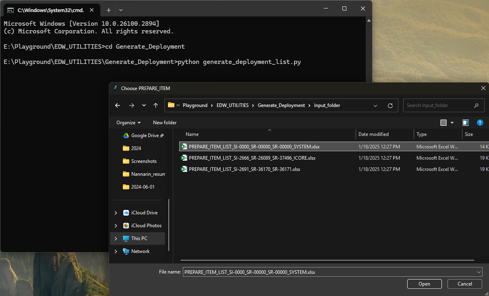
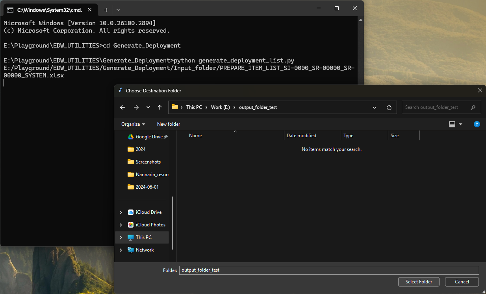
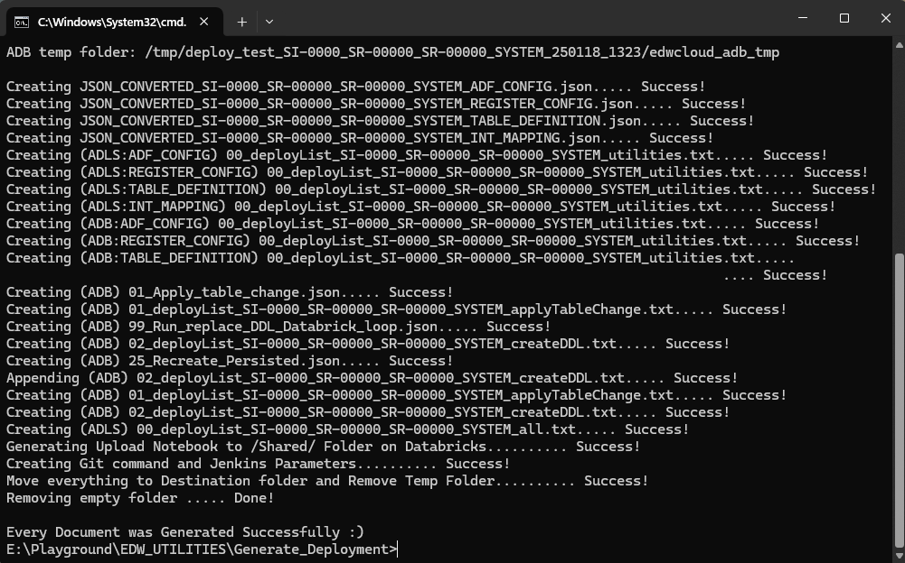
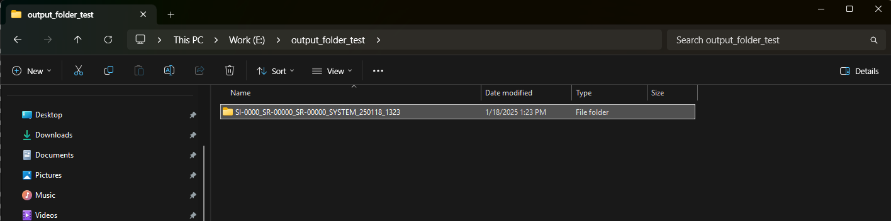

# Welcome to EDW_UTILITIES !!

## Set Up Environment and clone Repository

- First download [Python](https://www.python.org/downloads/)
- Open Command Prompt or WindowsPowerShell
- Go to Directory you want to clone Repository from git
- Clone Repository by using git clone command.
    ```
    git clone https://github.com/teerapatlaongdee/EDW_UTILITIES.git
    ```
- Then navigate to Repository
    ```
    cd EDW_UTILITIES
    ```
- Install library by using pip install command
    ```
    pip install -r requirements.txt
    ```


So now everythings ready for  **EDW_UTILITIES** 

## Utilities Program
- Generate_Deployment

### Generate_Deployment
Navigate to Generate_Deployment directory

```
cd Generate_Deployment
```

In folder ***input_folder*** see the excel template in file ***PREPARE_ITEM_LIST_SI-0000_SR-00000_SR-00000_SYSTEM.xlsx***

After the excel file is ready now you can running the program by following step
1. Running program
    ```
    python generate_deployment_list.py
    ```
2. Then will have Explorer popup for choosing your excel file that you prepared on previous step

3. Then will have another Explorer popup for choosing destination folder **\*\*Be careful long path**

4. After the program running without any Error. let's check the result on your destination folder



<!--  -->
### Have a nice day!!!
